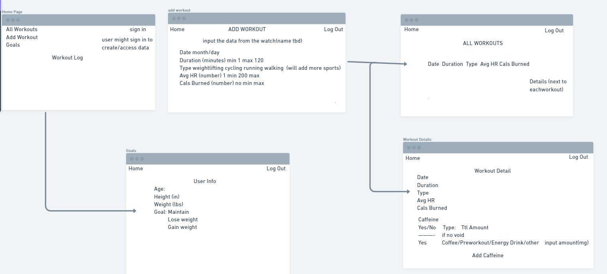
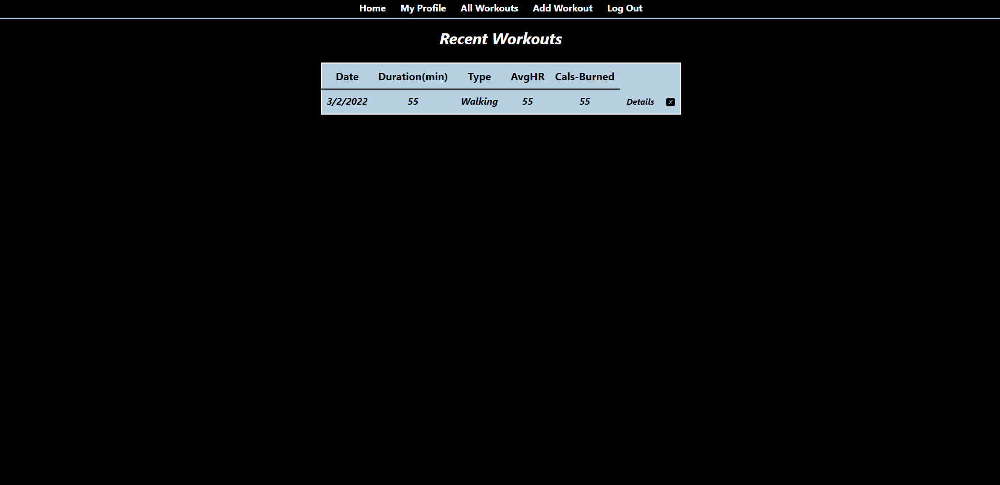
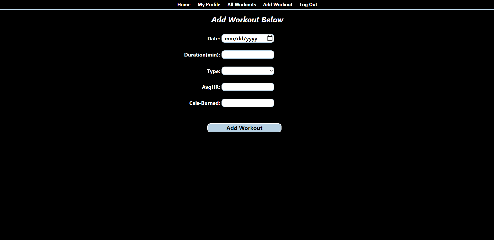

# Workout App

Access Here: https://cb-workout-log.herokuapp.com/

## Description
- An app focused on keeping track of workouts. Users can input specific data about their workouts and create weekly goals for themselves. 

## Technologies Used: 
  
    
     
  
    
     
  
  
  

## Wireframe

## Screenshots

## Credits
- Favicon from https://www.canva.com/

## Code Freeze
- Ability to delete/edit goals
- Checkbox for consumed caffeine 
- Enhance styling

## Stretch Goals
- Have each user only access/view their created data
- Track workouts logged by the date inputed on index page
- Add drop downs on certain nav links (workouts)
- Track meals (calories: protein, carbs, fat)